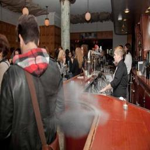
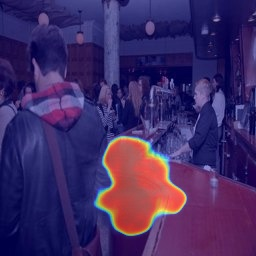

# SEG-GRAD-CAM
pytorch implementation of SEG-GRAD-CAM,which based on grad-cam it also have 3D SEG-GRAD-CAM which is useing for video.
see the paper [Towards Interpretable Semantic Segmentation via Gradient-weighted Class Activation Mapping](https://arxiv.org/abs/2002.11434)
## How to use

### Dependencies
This tutorial depends on the following libraries:

* pytorch
* opencv-python

### usage
[gradcam.py](gradcam.py):which is the formal implementation [GRAD-CAM](https://github.com/jacobgil/pytorch-grad-cam).My work is based on the work.

[gradcam_unet.py](gradcam_unet.py):which is the implementation SEG-GRAD-CAM.We use the model [deep smoke Segmentation](https://arxiv.org/abs/1809.00774)(like Unet).

you can run the test using [model](https://pan.baidu.com/s/16IolEoXFZChlTKNo2t5jnA) with password "3d7c"

[gradcam_3d.py](gradcam_3d.py):which is the implementation SEG-GRAD-CAM based on 3dunet.It's used for video Activation Mapping.
because the paper haven't been public.So the model will be release soon.But it is not important to vis activation map based your on model.

